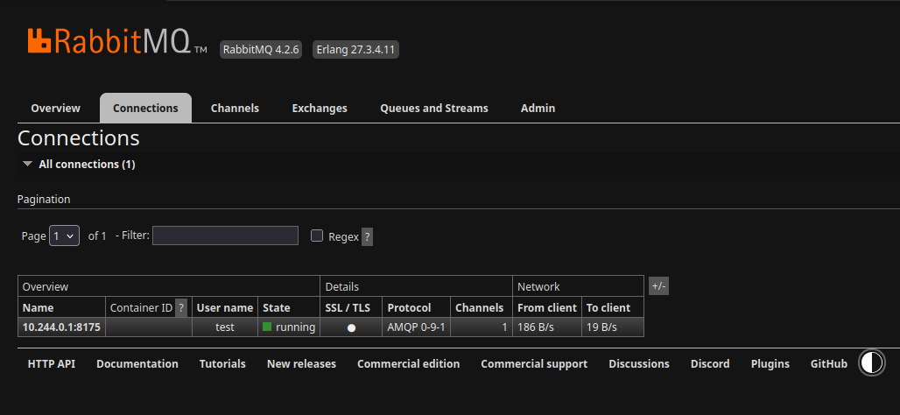

## What

This guide provides step-by-step instructions for generating custom TLS certificates, deploying RabbitMQ on Kubernetes using the official RabbitMQ Cluster Operator, configuring Mutual TLS (mTLS), and testing end-to-end encrypted client connections with Python.

## Why

In cloud-native and zero-trust security architectures, standard TLS only encrypts traffic and authenticates the server to the client. **Mutual TLS (mTLS)** enforces bidirectional authentication: both the server and the client must present trusted X.509 certificates. This ensures:

- **Zero-Trust Security**: Unauthorized clients cannot connect to your message broker, even if they possess valid username and password credentials.
- **Data Confidentiality & Integrity**: All AMQP protocol traffic in transit is encrypted using modern cryptographic standards (TLS 1.3).
- **Identity Authentication**: Certificate fields (such as Common Name) explicitly verify client identity before allowing message publishing or consumption.

## Prerequisites

Before proceeding, ensure you have the following installed:

- **Docker** (running container runtime)
- **kind** (Kubernetes in Docker)
- **kubectl** (Kubernetes CLI)
- **Helm** (v3+)
- **OpenSSL** (for certificate generation)
- **Python 3.9+** with `pip`

## Step 1: Provision the Kind Cluster

```bash
# kind
export CLUSTER_NAME=rabbitmq-test
kind delete cluster --name $CLUSTER_NAME
cat << EOF | kind create cluster --name $CLUSTER_NAME --config=-
kind: Cluster
apiVersion: kind.x-k8s.io/v1alpha4
nodes:
  - role: control-plane
EOF
# Install Cert Manager
helm install cert-manager oci://quay.io/jetstack/charts/cert-manager --version v1.21.1 --namespace cert-manager --create-namespace --set crds.enabled=true
# Rabbitmq Cluster Operator and Topology operator
kubectl apply -f https://github.com/rabbitmq/cluster-operator/releases/latest/download/cluster-operator.yml
```

## Step 2: Generate Certificates (PKI)

### Create Certificate Authority (CA)

Generate the CA private key and self-signed CA certificate:

```bash
# 1. Generate CA Private Key
openssl genrsa -out ca.key 4096

# 2. Generate Self-Signed Root CA Certificate (valid for 10 years)
openssl req -x509 -new -nodes -key ca.key -sha256 -days 3650 -subj "/C=TR/O=MyCompany/CN=MyRootCA" \
  -out ca.crt
```

### Create RabbitMQ Server Certificate

Generate the server private key, Certificate Signing Request (CSR) with Subject Alternative Names (SANs), and sign the server certificate with the Root CA.

> **Note**: SAN (Subject Alternative Name) entries must be modified to match your network topology. In this setup, we will access RabbitMQ externally via `NodePort`, so we include the Node IP along with the Kubernetes internal service DNS names.

```bash
# Generate Server Private Key
openssl genrsa -out server.key 2048

# Get nodes IP
kubectl get nodes -o jsonpath='{.items[*].status.addresses[?(@.type=="InternalIP")].address}'

# Generate Server CSR with Subject Alternative Names (SANs)
NODE_IP=$(kubectl get nodes -o jsonpath='{.items[0].status.addresses[?(@.type=="InternalIP")].address}')
openssl req -new \
  -key server.key \
  -out server.csr \
  -subj "/C=TR/O=MyCompany/CN=broker.example.com" \
  -addext "subjectAltName=DNS:rabbitmq,DNS:rabbitmq.rabbitmq,DNS:rabbitmq.rabbitmq.svc,DNS:rabbitmq.rabbitmq.svc.cluster.local,IP:${NODE_IP}"

# 3. Sign Server Certificate (Preserving SAN extensions from CSR)
openssl x509 -req -in server.csr \
  -CA ca.crt -CAkey ca.key -CAcreateserial \
  -out server.crt -days 365 -sha256 \
  -copy_extensions copy
```

**Verify Server Certificate SANs:**

```bash
openssl x509 -in server.crt -text -noout | grep -A 1 "Subject Alternative Name"
```

### Create Client Certificate

Generate the client private key, CSR, and signed client certificate:

```bash
# 1. Generate Client Private Key
openssl genrsa -out client.key 2048

# 2. Generate Client CSR
openssl req -new -key client.key -subj "/C=TR/O=MyCompany/CN=device001" -out client.csr

# 3. Sign Client Certificate with Root CA
openssl x509 -req -in client.csr -CA ca.crt -CAkey ca.key -CAcreateserial -out client.crt -days 365 -sha256
```

## Step 3: Configure RabbitMQ for mTLS on Kubernetes

Create the required Kubernetes Secrets in the `rabbitmq` namespace:

```bash
kubectl create ns rabbitmq
kubectl create secret generic rabbitmq-ca-cert -n rabbitmq --from-file=ca.crt=ca.crt
kubectl create secret tls rabbitmq-server-certs -n rabbitmq --cert=server.crt --key=server.key
```

> **Note**: This setup uses the official **RabbitMQ Cluster Operator** (maintained by VMware/Broadcom) alongside **cert-manager**.

Below is a complete manifest for the `RabbitmqCluster` custom resource configured for TLS 1.3:

```yaml
cat << EOF | kubectl apply -f -
apiVersion: rabbitmq.com/v1beta1
kind: RabbitmqCluster
metadata:
  name: rabbitmq
  namespace: rabbitmq
spec:
  override:
    service:
      spec:
        ports:
        - appProtocol: amqps
          name: amqps
          nodePort: 30674
          port: 5671
          protocol: TCP
          targetPort: 0
        - appProtocol: amqp
          name: amqp
          nodePort: 30673
          port: 5672
          protocol: TCP
          targetPort: 0
        - name: management
          nodePort: 31673
          port: 15672
          protocol: TCP
          targetPort: 0
        - name: mqtt
          nodePort: 31884
          port: 1883
          protocol: TCP
          targetPort: 0
  persistence:
    storage: 4Gi
    storageClassName: standard
  rabbitmq:
    additionalConfig: |
      ssl_options.verify = verify_peer
      ssl_options.fail_if_no_peer_cert = false
      ssl_options.versions.1 = tlsv1.3
      ssl_options.ciphers.1 = TLS_AES_256_GCM_SHA384
      ssl_options.ciphers.2 = TLS_AES_128_GCM_SHA256
      ssl_options.ciphers.3 = TLS_CHACHA20_POLY1305_SHA256
  replicas: 1
  resources:
    limits:
      memory: 4Gi
    requests:
      cpu: "1"
      memory: 500Mi
  service:
    type: NodePort
  terminationGracePeriodSeconds: 604800
  tls:
    secretName: rabbitmq-server-certs
    caSecretName: rabbitmq-ca-cert
    disableNonTLSListeners: false
EOF
kubectl wait --for=condition=AllReplicasReady rabbitmqcluster/rabbitmq -n rabbitmq --timeout=300s
```

Create a user, assign administrative tags, and set full permissions:

```bash
kubectl exec -n rabbitmq rabbitmq-server-0 -c rabbitmq -- rabbitmqctl add_user test test123
kubectl exec -n rabbitmq rabbitmq-server-0 -c rabbitmq -- rabbitmqctl set_user_tags test administrator
kubectl exec -n rabbitmq rabbitmq-server-0 -c rabbitmq -- rabbitmqctl set_permissions -p / test ".*" ".*" ".*"
```

## Step 4: Access the RabbitMQ Management Console

Using the `test` user and `test123` password created above, navigate to `http://${NODE_IP}:31673` (e.g., <http://172.18.0.3:31673>) in your browser and log in.

Navigate to the **Connections** tab to observe incoming client connections in real time.

## Step 5: Test the mTLS Connection

To test the mTLS connection, run the Python script below. **Remember to update** the `HOST` variable to match your cluster Node IP.

```bash
pip install pika --break-system-packages
cat << 'EOF' > test-rabbitmq-tls-script.py
import ssl
import sys
import time
import pika

HOST = "172.18.0.3"
PORT = 30674
VHOST = "/"

USERNAME = "test"
PASSWORD = "test123"

CA_CERT = "./ca.crt"
CLIENT_CERT = "./client.crt"
CLIENT_KEY = "./client.key"

SERVER_HOSTNAME = None

def build_ssl_context() -> ssl.SSLContext:
    context = ssl.SSLContext(ssl.PROTOCOL_TLS_CLIENT)
    context.load_verify_locations(cafile=CA_CERT)
    context.load_cert_chain(certfile=CLIENT_CERT, keyfile=CLIENT_KEY)

    if SERVER_HOSTNAME is None:
        context.check_hostname = False
        context.verify_mode = ssl.CERT_REQUIRED
    else:
        context.check_hostname = True
        context.verify_mode = ssl.CERT_REQUIRED

    return context

def main() -> int:
    ssl_context = build_ssl_context()
    ssl_options = pika.SSLOptions(ssl_context, server_hostname=SERVER_HOSTNAME)
    credentials = pika.PlainCredentials(USERNAME, PASSWORD)

    parameters = pika.ConnectionParameters(
        host=HOST,
        port=PORT,
        virtual_host=VHOST,
        credentials=credentials,
        ssl_options=ssl_options,
        heartbeat=30,
        blocked_connection_timeout=10,
        connection_attempts=3,
        retry_delay=2,
    )

    print(f"[*] Connecting: amqps://{HOST}:{PORT}{VHOST}  (user={USERNAME})")

    try:
        connection = pika.BlockingConnection(parameters)
    except pika.exceptions.ProbableAuthenticationError as exc:
        print(f"[!] Authentication error: {exc}")
        return 1
    except pika.exceptions.ProbableAccessDeniedError as exc:
        print(f"[!] Access denied (vhost/permission): {exc}")
        return 1
    except ssl.SSLError as exc:
        print(f"[!] TLS/SSL error: {exc}")
        return 1
    except Exception as exc:  # noqa: BLE001
        print(f"[!] Connection error: {type(exc).__name__}: {exc}")
        return 1

    print("[+] Connection successful!")

    try:
        channel = connection.channel()
        print("[+] Channel opened.")

        server_props = connection._impl.server_properties
        print(f"    RabbitMQ version : {server_props.get('version')}")
        print(f"    Platform         : {server_props.get('platform')}")
        print(f"    Cluster name     : {server_props.get('cluster_name')}")

        queue_name = "mtls_demo_queue"
        channel.queue_declare(queue=queue_name, durable=True, auto_delete=False)
        print(f"[+] Queue created: '{queue_name}'")

        msg_count = 5
        for i in range(1, msg_count + 1):
            msg_body = f"mTLS Test Message #{i} - Sent at {time.strftime('%H:%M:%S')}"
            channel.basic_publish(
                exchange="",
                routing_key=queue_name,
                body=msg_body,
                properties=pika.BasicProperties(
                    delivery_mode=pika.DeliveryMode.Persistent
                )
            )
            print(f"    [>] Sent [{i}/{msg_count}]: {msg_body}")

        print(f"\n[!] You can check via Management UI:")
        print(f"    Management UI URL: http://{HOST}:31673")
        print(f"    Vhost            : {VHOST}")
        print(f"    Queue            : {queue_name} ({msg_count} messages ready)")
        print(f"\n[*] Keeping connection open for 45 seconds (to view in Management UI)...")
        print("    (Press Ctrl+C to close early)\n")

        hold_seconds = 45
        for remaining in range(hold_seconds, 0, -5):
            print(f"    ... Time remaining: {remaining} sec (Management UI -> Connections / Queues)")
            time.sleep(5)
            connection.process_data_events()

        channel.close()
    except KeyboardInterrupt:
        print("\n[!] Stopped by user.")
    finally:
        connection.close()
        print("[*] Connection closed.")

    return 0

if __name__ == "__main__":
    sys.exit(main())
EOF
```

Run the script:

```bash
python3 test-rabbitmq-tls-script.py
```

Expected Output:

```text
╰─$ python3 test-rabbitmq-tls-script.py
# [*] Connecting: amqps://172.18.0.3:30674/  (user=test)
# [+] Connection successful!
# [+] Channel opened.
#     RabbitMQ version : 4.2.6
#     Platform         : Erlang/OTP 27.3.4.11
#     Cluster name     : rabbitmq
# [+] Queue created: 'mtls_demo_queue'
#     [>] Sent [1/5]: mTLS Test Message #1 - Sent at 13:28:08
#     [>] Sent [2/5]: mTLS Test Message #2 - Sent at 13:28:08
#     [>] Sent [3/5]: mTLS Test Message #3 - Sent at 13:28:08
#     [>] Sent [4/5]: mTLS Test Message #4 - Sent at 13:28:08
#     [>] Sent [5/5]: mTLS Test Message #5 - Sent at 13:28:08

# [!] You can check via Management UI:
#     Management UI URL: http://172.18.0.3:31673
#     Vhost            : /
#     Queue            : mtls_demo_queue (5 messages ready)

# [*] Keeping connection open for 45 seconds (to view in Management UI)...
#     (Press Ctrl+C to close early)

#     ... Time remaining: 45 sec (Management UI -> Connections / Queues)
#     ... Time remaining: 40 sec (Management UI -> Connections / Queues)
#     ... Time remaining: 35 sec (Management UI -> Connections / Queues)
#     ... Time remaining: 30 sec (Management UI -> Connections / Queues)
#     ... Time remaining: 25 sec (Management UI -> Connections / Queues)
#     ... Time remaining: 20 sec (Management UI -> Connections / Queues)
#     ... Time remaining: 15 sec (Management UI -> Connections / Queues)
#     ... Time remaining: 10 sec (Management UI -> Connections / Queues)
#     ... Time remaining: 5 sec (Management UI -> Connections / Queues)
# [*] Connection closed.
```

You can also verify the active connection and message queue status in the RabbitMQ Management UI:



## References

1. [How to Install Kind Cluster with Gateway?](https://bulmus.org/posts/labs/kubernetes/install-kind-cluster/)
2. [Installing cert-manager with Helm](https://cert-manager.io/docs/installation/helm/#installing-cert-manager-with-helm)
3. [Installing RabbitMQ Cluster Operator in a Kubernetes Cluster](https://www.rabbitmq.com/kubernetes/operator/install-operator)
4. [RabbitMQ Cluster Kubernetes Operator - GitHub](https://github.com/rabbitmq/cluster-operator)
